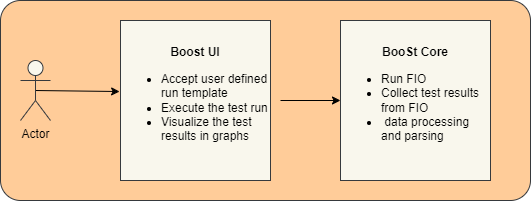
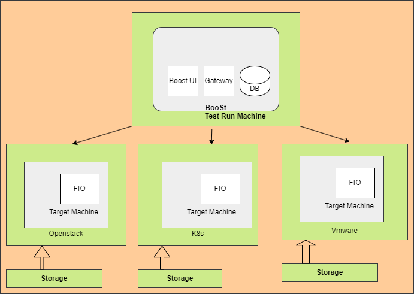

# Overview

This Project provides the tools and configuration to perform the testing of any kind of block storage.

The project provides feature to visualize the performance of storage in a graphical way. The user would be able to run the performance test in a controlled way.

The project provide the ability to test the storage on Openstack, K8s and vmware as well.

The project relies on well known load generator tool called FIO.
### Goals

- To test block storage
- Provide UI for VMs provisioning on Openstack
- Attach storage with the provisioned VM
- Provide UI to customize I/O workloads
- Provide UI to start the run and monitor its status
- Start the FIO test as per the customer's inputs
- Analysis of storage performance metrics
- Display performance graphs for the run in GUI
- Download the graphs as a PPT

### Non Goals

- Provisioning of Storage cluster deployment
- Stress testing of CPU and RAM

### Basic architecture overview

This project contains various components:
- BooSt-UI
- BooSt-core

Boost-UI accepts the inputs from users for test run. It will start the test run as per users inputs. Graphs will be displayed after completion of the Jobs.

BooSt-core does all analysis and data processing. Its start the FIO and collects the test results data. Test results data will be further pared as per need to generate the graphs.

Currently, this tool runs all the components on one machine. Storage to be tested should be attached with the machine.

### How to run the test

- Prepare test machine
- Prepare target machine and attach storage disks
- Clone the code from GitHub on test machine
- Install boost on test machine
- Open GUI on test machine
- In GUI, go to Jobs and start `new Job`
- Input all required parameters for the test
- Start the test run and wait for its completion
- Click the `graphs` to check the results
- To download the graphs, use 'download graphs' button. PPT file will be downloaded.

### How to Test Openstack
Resource creation i.e virtual machine should be done prior to using the tools.

All storage disks to be tested should be attached with the machine.

### Future Scope

In Future, this project will be having support for various features like:

- Auto resource creation
- Auto resource cleanups
- Provide UI for VMs provisioning on Kubernetes and Vmware
- Benchmark testing by comparing test results for two test run
- To show the performance deviation for two test runs
- To integrate the tool as acceptance test with Open Source tool called Sylva (https://gitlab.com/sylva-projects/sylva)
- To provide support for testing of object storage

### Motivation:

- Testing storage manually is very complex and time taking task
- Existing I/O benchmark/test tools out there aren’t flexible enough to do what we wanted.